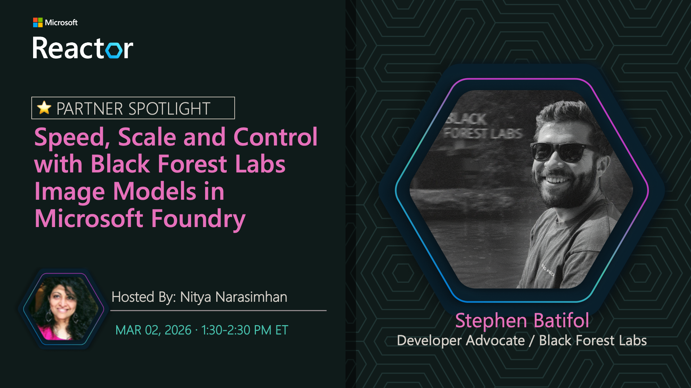
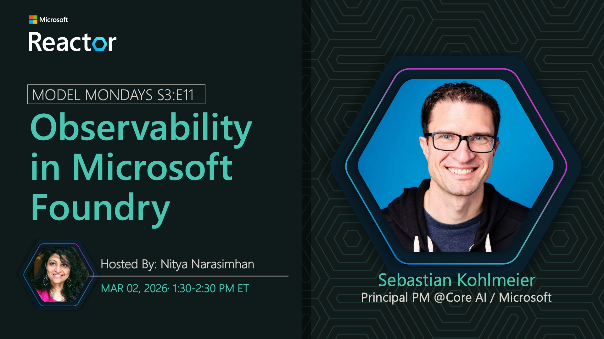

# Hands-on With BFL + Microsoft Foundry Observability

**Date:** March 2, 2026  
**Season:** 3 | **Episode:** 11  
**Host:** [Nitya Narasimhan](https://linkedin.com/in/nityan)

 

## Spotlight: Black Forest Labs 🌟

| Speed, Scale, and Control with Black Forest Labs Image Models in Microsoft Foundry |
|:---|
| Abstract:  Stephen Batifol, Developer Advocate at Black Forest Labs, joins Model Mondays to show how teams use BFL’s generative image models on Microsoft Foundry to move from experimentation to real‑world creative workflows at scale with fewer touch‑ups, stronger brand fidelity, and state‑of‑the‑art image quality. This hands‑on session features a live demo and practical patterns for building scalable image pipelines, so you can ship complete creative campaigns in days, not weeks.|
| Speaker Bio:   Stephen Batifol is a Developer Advocate at Black Forest Labs. He previously worked at Milvus, working on Vector Database and as a Machine Learning Ops at Wolt, where he created and worked on the ML Platform, and previously as a Data Scientist at Brevo. Stephen studied Computer Science and Artificial Intelligence.|

 

## Observability in Microsoft Foundry

Building agentic AI solutions at enterprise scale requires a unified management interface to observe every aspect of your AI fleet from plan to production. Discover the Foundry Control Plane for multi-agent fleet operations.

**Key Features:**
- Unified management interface
- Multi-agent fleet orchestration
- Comprehensive observability
- Enterprise-scale operations
- End-to-end monitoring and insights

**Speaker:** [Sebastian Kohlmeier](https://linkedin.com/in/sebastiankohlmeier)

_Sebastian is a Partner Group Product Manager at Microsoft, focusing on end-to-end observability in Microsoft Foundry - covering evaluations, tracing, monitoring, and more._

**Resources:**
- [Foundry Control Plane](https://learn.microsoft.com/azure/ai-foundry/control-plane/overview?view=foundry)
- [Foundry Observability](https://learn.microsoft.com/azure/ai-foundry/concepts/observability?view=foundry-classic)
- [Foundry Portal](https://ai.azure.com)

### Summary

Join Sebastian Kohlmeier as he demonstrates the Foundry Control Plane and its capabilities for managing multi-agent systems at enterprise scale. Learn how to monitor, manage, and optimize your AI fleet operations from a unified interface.

**Related AMA:** [View AMA Discussion](../foundry-fridays/2026-03-06-s03-e11.md)

 

## News Highlights

1. TBA
1. TBA
1. TBA
1. TBA
1. TBA

 

## This Week In Hugging Face

1. Model 1
1. Model 2
1. Model 3
