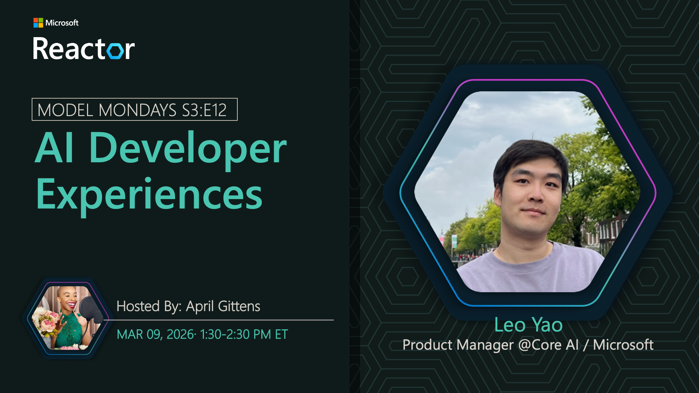

## AI Toolkit

**Date:** March 9, 2026  
**Season:** 3 | **Episode:** 12  
**Host:** [April Gittens](https://linkedin.com/in/aprilgittens)

### News Highlights

1. [AI Toolkit for VS Code](https://aka.ms/model-mondays) - IDE-integrated development
2. [End-to-End Workflow](https://aka.ms/model-mondays) - Plan, build, evaluate, deploy
3. [Developer Experience](https://aka.ms/model-mondays) - Streamlined IDE integration
4. [Model Customization](https://aka.ms/model-mondays) - Fine-tuning from VS Code
5. [Microsoft Foundry Integration](https://aka.ms/model-mondays) - Seamless platform connection

### Tech Spotlight: AI Toolkit

Want to plan, build, evaluate, customize, and deploy your agentic AI solutions right from your IDE? The AI Toolkit accelerates end-to-end developer experiences with Microsoft Foundry directly in Visual Studio Code.

**Key Features:**
- Integrated development environment
- End-to-end AI workflow in VS Code
- Model evaluation and testing
- Fine-tuning and customization
- Direct deployment to Microsoft Foundry

**Speaker:** [Leo Yao](https://www.linkedin.com/in/yunchengyao/)

_Leo is a Product Manager at Microsoft, working on the AI Toolkit and developer experience initiatives within Core AI._

**Resources:**
- [AI Toolkit Extension](https://aka.ms/model-mondays)
- [Documentation](https://aka.ms/model-mondays)
- [Video Tutorials](https://aka.ms/model-mondays)

### Summary

Join Rong Lu as she showcases the AI Toolkit and demonstrates how it accelerates your development workflow. Learn how to plan, build, evaluate, customize, and deploy agentic AI solutions directly from Visual Studio Code with seamless Microsoft Foundry integration.

**Related AMA:** [View AMA Discussion](../foundry-fridays/2026-03-13-s03-e12.md)
