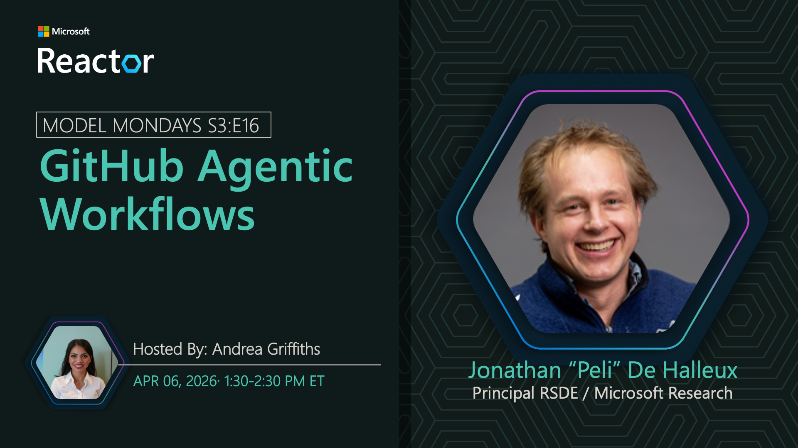

## GitHub Agentic Workflows

**Date:** April 6, 2026  
**Season:** 3 | **Episode:** 16  
**Host:** [Andrea Griffiths](https://www.linkedin.com/in/acolombiadev/)

### Tech Spotlight: GitHub Agentic Workflows

GitHub Agentic Workflows lets you automate GitHub tasks safely using AI agents – by writing workflows in plain English. Explore how this technology works and discover key features and examples in context.

**Key Features:**
- Natural language workflow definition
- Safe AI-powered automation
- GitHub integration
- Developer-friendly interface
- Rich workflow examples

**Host:** [Andrea Griffiths](https://www.linkedin.com/in/acolombiadev/)

_Andrea is a Senior Developer Advocate at GitHub,  specializing in AI-powered developer experiences that scale to 180M+ engineers worldwide. She thrives in building strong customer relationships, holistic decision-making, and enabling teams to harness AI and open source for accelerated software development._

**Speaker:** [Peli de Halleux](https://linkedin.com/in/pelidehalleux)

_Peli is a Principal Engineer at GitHub, leading the development of GitHub Agentic Workflows and AI-powered automation capabilities. He works on enabling developers to automate GitHub tasks safely using AI agents with natural language instructions._

**Resources:**
1. [GitHub Agentic Workflows: Docs](https://github.github.com/gh-aw/) - Learn concepts & explore examples
1. [GitHub Agentic Workflows: Repo](https://github.com/github/gh-aw) - Repository with code & samples
1. [Weekly Updates](https://github.github.com/gh-aw/blog/) - Changelogs and Latest Release notes

### Summary

Join lead maintainer Peli de Halleux as he demonstrates GitHub Agentic Workflows and shows how to automate GitHub tasks using AI agents with plain English instructions. Learn about the technology, explore key features, and see real-world examples of AI-powered GitHub automation.

**Related AMA:** [View AMA Discussion](../foundry-fridays/2026-04-10-s03-e16.md)
